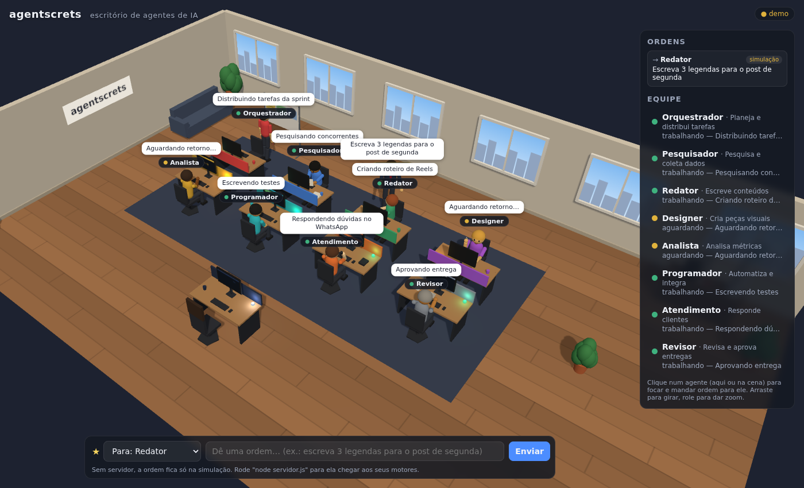

# agentscrets

Escritório 3D de agentes de IA. Cada agente (motor) tem a sua mesa e um bonequinho que faz a sua função: digita, lê documentos, fala ao telefone, desenha, analisa gráficos ou escreve no quadro branco. **Você também está lá**: o seu bonequinho de chefe fica na mesa da frente e é por ele que você dá ordens à equipe — ele levanta, vai até a mesa do agente, fala a ordem, e o servidor entrega ao seu motor de verdade. A resposta do motor volta para o escritório.



## O time

Uma software house de agentes, focada em **sistemas sob medida (ERP, CRM, painéis, integrações) e sites**:

| Agente | id | O que faz |
|---|---|---|
| Tech Lead | `orquestrador` | Entende o pedido, define a arquitetura e distribui as tarefas (delega e acompanha até a entrega final) |
| Requisitos | `requisitos` | Regras de negócio, histórias de usuário, critérios de aceite, entidades do banco |
| Designer UI/UX | `designer` | Telas, fluxos, design system e protótipos em HTML/CSS |
| Front-end | `frontend` | Sites, landing pages e telas de sistema (HTML, CSS, React) |
| Back-end | `backend` | APIs, banco de dados, autenticação e integrações (Pix, nota fiscal, WhatsApp…) |
| QA | `qa` | Code review, testes e segurança; revisa as entregas dos agentes marcados com "revisão" |
| DevOps | `devops` | Docker, deploy na VPS, HTTPS, CI/CD, monitoramento e backups |
| Documentador | `documentador` | README, documentação da API, manuais do usuário e a documentação viva do projeto |

As funções e instruções de cada um ficam em `motores/time-dev.js` (e nos `motores.*.json` de exemplo); dá para mudar tudo em ⚙ Equipe. **Quem já usava o time antigo** (Pesquisador, Redator, Programador, Revisor) é convertido sozinho na primeira vez que o servidor sobe: cada papel mantém a IA que você tinha escolhido (Pesquisador → Requisitos, Programador → Back-end, Redator → Documentador, Revisor → QA), e Front-end e DevOps entram com a mesma IA do Back-end. As rotinas acompanham a troca de nomes.

## Rodando

Precisa do Node 18+.

```bash
npm install               # uma vez (SDK da Claude, para os motores embutidos)
node servidor.js          # abre em http://localhost:8787
```

Sem nenhum motor conectado, o escritório roda numa **simulação** (modo demo) para você ver tudo funcionando. Para simular motores "de verdade" mandando status via HTTP:

```bash
node exemplos/simular-motores.js
```

Controles: arraste para girar, role para dar zoom, clique num agente no painel para focar nele, `Esc` para ver o escritório inteiro.

## Deixando no ar 24h

O `node servidor.js` só fica no ar enquanto o terminal estiver aberto. Para rodar o tempo todo, escolha onde ele vai morar:

| Onde | Bom para | Como |
|---|---|---|
| **Render** (nuvem) | Acessar de qualquer lugar sem cuidar de servidor | `render.yaml` pronto |
| **VPS** (Hetzner, DigitalOcean, Contabo…) com Docker | Mais barato a longo prazo, controle total | `Dockerfile` pronto |
| **Seu computador** com PM2 | Motores rodando na mesma máquina | `ecosystem.config.cjs` pronto |

Em todos os casos, o servidor:
- **exige senha** quando fica acessível pela rede (`ESCRITORIO_SENHA`); o navegador pede a senha uma vez. Sem ela, ele se recusa a abrir;
- **salva status e ordens em disco** (`DADOS_DIR`, padrão `./dados`) e recarrega ao reiniciar;
- tem a rota **`/saude`** para a hospedagem checar se está vivo, e reinicia sozinho se cair (pela hospedagem, Docker ou PM2).

### Render

1. Em [render.com](https://render.com): **New → Blueprint** e escolha este repositório. O `render.yaml` configura tudo.
2. Em **Environment**, copie a `ESCRITORIO_SENHA` gerada (ou troque por uma sua).
3. Abra a URL `https://<nome>.onrender.com` e entre com qualquer usuário + essa senha.

O plano grátis do Render desliga o serviço quando ninguém acessa e não guarda arquivos entre reinícios; para 24h de verdade e histórico salvo, use um plano pago (o `render.yaml` já pede o `starter` com disco).

### VPS com Docker (passo a passo)

1. **Alugue um VPS** com Ubuntu (1 GB de RAM basta) e instale o Docker: `curl -fsSL https://get.docker.com | sh`.
2. **Baixe o escritório e crie as configurações:**
   ```bash
   git clone https://github.com/PedroCardoso57/agentscrets && cd agentscrets
   cp .env.exemplo .env                  # senha e chaves das IAs
   cp motores.exemplo.json motores.json  # qual IA cada agente usa
   nano .env                             # preencha ESCRITORIO_SENHA e as chaves
   ```
3. **Suba:**
   ```bash
   docker compose up -d                  # → http://IP-DO-VPS:8787
   ```
4. **HTTPS (recomendado):** aponte um domínio (ex.: `escritorio.seudominio.com`) para o IP do VPS, coloque-o em `DOMINIO` no `.env` e rode `docker compose --profile https up -d`. O certificado sai sozinho. Depois feche a porta 8787 no firewall do VPS.

O escritório religa sozinho se cair ou se o VPS reiniciar. Comandos úteis: `docker compose logs -f` (ver o que está acontecendo), `docker compose restart` (depois de mudar o `.env`) e `git pull && docker compose up -d --build` (atualizar). Mudanças no `motores.json` valem na próxima ordem, sem reiniciar.

### Seu computador com PM2

```bash
npm install                # dependências do escritório
npm install -g pm2
pm2 start ecosystem.config.cjs
pm2 save && pm2 startup    # volta sozinho quando o computador liga
```

Fica disponível só nesta máquina (`http://localhost:8787`), sem senha. Para abrir em outros aparelhos da casa, descomente `HOST` no `ecosystem.config.cjs` e defina `ESCRITORIO_SENHA`.

### Conectando os motores ao escritório na nuvem

Os motores precisam do endereço e do token (por padrão, o token é a própria senha; para separar, defina `ESCRITORIO_TOKEN`):

```bash
ESCRITORIO_URL=https://seu-escritorio.onrender.com ESCRITORIO_TOKEN=sua-senha node exemplos/simular-motores.js
```

Em qualquer linguagem, mande o cabeçalho `Authorization: Bearer <token>` em todas as chamadas. Os webhooks do `motores.json` podem ir na variável `MOTORES_JSON` (o conteúdo do arquivo), já que o arquivo não vai para o git.

## O que cada bonequinho faz

| Estado | Comportamento |
|---|---|
| `ocioso` | Encostado na cadeira, olhando em volta e se espreguiçando; tela em descanso |
| `trabalhando` | Faz a **atividade** dele (tabela abaixo); luz da mesa pulsa em verde |
| `aguardando` | Mão no queixo, batucando a mesa |
| `concluido` | Comemora de braços para cima e depois relaxa com as mãos atrás da cabeça |
| `erro` | Mãos no rosto, balançando a cabeça; tela e luz piscam em vermelho |

| Atividade | Quando trabalha… |
|---|---|
| `digitar` | Digita no teclado, com código/texto aparecendo no monitor |
| `ler` | Segura e lê um documento, virando páginas |
| `telefone` | Fala ao telefone; o monitor mostra a fila de clientes |
| `desenhar` | Desenha na mesa digitalizadora; o monitor mostra o desenho |
| `analisar` | Mexe no mouse diante de gráficos e às vezes para para pensar |
| `quadro` | Levanta, vai até o quadro branco e escreve o plano com post-its |

## Dando ordens (você é o chefe)

Use a barra de baixo da tela:

1. Escolha para quem é a ordem (um agente ou **todos**). Clicar num agente no painel ou na cena já seleciona ele. Também dá para começar a ordem com `@backend ...`.
2. Escreva e aperte **Enviar**.
3. O seu bonequinho levanta, vai até a mesa do agente (ou para a frente da equipe, se for para todos), fala a ordem e volta. O agente vira na cadeira para ouvir.
4. A ordem aparece em **Ordens** no painel, com o andamento: *aguardando motor* → *entregue ao motor* → *respondida*. A resposta do motor também aparece no balão do agente.

Sem o servidor rodando (ou no modo demo), os agentes simulados cumprem a ordem e respondem, marcados como *simulação*. Com `node servidor.js`, a ordem vai de verdade para os seus motores.

## Configurando a equipe

Edite `src/agentes.js`. Cada agente tem:

```js
{ id: 'backend', nome: 'Back-end', funcao: 'APIs, banco de dados e integrações', atividade: 'digitar', cor: '#3fb27f', cabelo: '#1a1a1a', pele: '#e0ac69' }
```

As mesas são distribuídas sozinhas (8 por bloco); a sala cresce conforme a equipe aumenta.

Com o servidor, a equipe é a do `motores.json`: para tirar alguém, use **Remover da equipe** no ⚙ Equipe (a mesa some na hora; as entregas antigas continuam no arquivo).

O seu bonequinho é o `CHEFE`, no mesmo arquivo: troque `nome` (aparece como "★ Você"), cores, cabelo e pele.

## Ligando as suas IAs (motores embutidos)

O jeito principal: o próprio servidor chama a IA de cada agente. Você só configura o `motores.json` (copie de `motores.exemplo.json`):

```json
{
  "orquestrador": { "provedor": "anthropic", "modelo": "claude-opus-5-5", "delegar": true, "funcao": "Tech Lead: arquitetura e tarefas", "instrucoes": "Você é o Tech Lead..." },
  "backend":      { "provedor": "anthropic", "modelo": "claude-opus-5-5", "funcao": "APIs e banco de dados", "instrucoes": "Você é o Dev Back-end..." },
  "qa":           { "provedor": "openai", "modelo": "<modelo da OpenAI>", "instrucoes": "..." },
  "requisitos":   { "provedor": "gemini", "modelo": "<modelo do Gemini>", "instrucoes": "..." },
  "devops":       { "webhook": "https://seu-n8n.com/webhook/devops" }
}
```

| `provedor` | IA | Chave (no `.env`) |
|---|---|---|
| `anthropic` | Claude | `ANTHROPIC_API_KEY` (console.anthropic.com) |
| `openai` | GPT | `OPENAI_API_KEY` (platform.openai.com) |
| `gemini` | Gemini | `GEMINI_API_KEY` (aistudio.google.com) |
| `compativel` | OpenRouter, DeepSeek, Groq, Ollama… | variável que você indicar em `chaveEnv`, mais `baseUrl` |
| `webhook` (só `"webhook": "url"`) | n8n, Make, API sua | — |

- **Assinatura de chat não é chave de API.** ChatGPT Plus, Claude Pro, Gemini Advanced etc. servem para usar no site ou no app. Para o escritório chamar a IA sozinho, crie uma chave de API no painel de cada provedor; ela é cobrada por uso, à parte. Use só os provedores que quiser, e cada agente pode usar um diferente.
- **`instrucoes`** é o papel do agente (o "prompt de sistema"); `funcao` é a descrição curta que o Orquestrador lê para decidir a quem passar cada tarefa.
- **`delegar: true`** (Orquestrador): ele responde com um plano e o escritório cria as ordens para os outros agentes sozinho. Aparecem no painel como "Orquestrador → Redator".
- **Claude:** `esforco` (`low`, `medium`, `high`, `xhigh`, `max`; padrão `medium`) troca qualidade por custo. Se a IA recusar um pedido por segurança, o próprio servidor da Anthropic tenta de novo com um modelo alternativo (*fallback* automático).
- O status de cada agente e a IA que ele usa aparecem no painel. Erros (chave faltando, provedor fora do ar) aparecem como resposta e deixam o bonequinho em "erro".
- Se o servidor reiniciar no meio de uma tarefa, ela é marcada como interrompida (em vez de ser repetida e cobrada de novo sem você saber).

Agentes que não estão no `motores.json` continuam podendo ser ligados de fora, pelas rotas abaixo.

## Crânio: a bola de cristal que decide (Laya)

O [Laya](https://github.com/NandhaKishorM/laya) (Convai Innovations, Apache 2.0, grátis) é um modelo de **decisão**: não escreve textos, mas escolhe entre opções e diz a certeza, em milissegundos. No escritório ele é o **Crânio**, uma bola de cristal em cima da sua mesa, acesa quando o Laya está no ar. **Toda decisão passa por ela:**

| Situação | O que o Crânio faz |
|---|---|
| Ordem para **🔮 Crânio decide** | Escolhe o agente pela função de cada um e a urgência; na dúvida (abaixo de `LAYA_CONFIANCA_MINIMA`), manda para o Orquestrador. |
| Você escolhe um agente direto | Confirma, ou registra quem ele indicaria; a sua escolha vale. |
| O Orquestrador delega uma tarefa | Confirma ou, se tiver certeza de que outro agente é mais adequado, **redireciona**. |
| Ordem para todos | Segue direto (não há o que decidir). |
| Laya fora do ar | A ordem segue direto, marcada "Crânio fora do ar". |

**Como o Crânio pergunta ao Laya:** o Laya tem preferências que não têm a ver com o pedido (pela posição do agente na lista e pelo próprio texto das funções). Para anular isso, o Crânio (1) faz a pergunta "qual agente?" girando a lista, (2) pergunta a cada agente "este pedido é sobre a sua função?" (sim/não) e (3) mede a preferência do Laya com um pedido vazio e a desconta. O método pode ser trocado com `LAYA_METODO` (`combinado`, `escolha` ou `simnao`). Para ver como ele pesou um pedido, abra no navegador `https://SEU-DOMINIO/api/decisor/teste?texto=seu pedido`.

Na cena, o seu bonequinho levanta e põe as mãos sobre a bola, ela pulsa e solta um feixe de luz até o agente, e um balão mostra a decisão; as delegações do Orquestrador também soltam o feixe. O painel e a documentação registram cada decisão. Clicar na bola foca a câmera nela.

Para ligar no VPS (precisa de ~3 GB de RAM livres; confira com `free -h`):

```bash
nano .env      # descomente LAYA_URL=http://laya:8000 e ponha COMPOSE_PROFILES=https,laya
docker compose up -d --build
docker compose logs -f laya   # na primeira vez ele baixa o modelo (~2 GB); espere "Uvicorn running"
```

O Laya decide melhor quanto mais clara for a **função** de cada agente (em ⚙ Equipe).

## Documentação viva (mantida pelo Documentador)

O botão **📄 Documentação** abre os documentos que o **Documentador** mantém atualizados sozinho, **um por projeto**:

- **Cada cliente tem a sua documentação**, com visão geral, escopo e módulos, arquitetura e stack, regras de negócio, decisões, entregas, pendências e histórico. Ela parte da ficha do cliente e só recebe o que é daquele projeto. Escolha o projeto no seletor da janela.
- **O documento Geral** cobre o escritório: a equipe e as IAs, a lista de projetos e os trabalhos que não são de nenhum cliente (ex.: "configure o backup do servidor").
- **Como o escritório sabe de qual projeto é cada coisa:** pelo cliente escolhido na barra de ordens ou, se você não escolher, **reconhecendo pelo texto do pedido**. Vale o nome do cliente, o id ou os **apelidos** cadastrados na ficha ("ERP da padaria, PDV do Zé"), e também uma palavra que só aparece no nome de um cliente. O cartão mostra "👤 Padaria do Zé (reconhecido no pedido)". Pedidos que citam dois projetos ou nenhum ficam no Geral. As tarefas que o Tech Lead distribui, os ajustes e a entrega final herdam o projeto da ordem original.
- O escritório anota as novidades (entregas, decisões do Crânio, avaliações, fichas) e, a cada poucos minutos, o Documentador reescreve só os documentos que tiveram novidade. **Atualizar agora** força o projeto aberto e **Baixar .md** salva o arquivo dele.
- Os arquivos ficam em `dados/documentacao.md` (Geral) e `dados/documentacao/<cliente>.md`, cada um com a versão anterior em `.anterior`. Quem já tinha a documentação de antes encontra o conteúdo no Geral.
- Para trocar o responsável ou o intervalo: `DOCUMENTADOR=documentador` e `DOC_INTERVALO_MIN=3` no `.env`. O documentador precisa ter uma IA configurada (não webhook).

## Visual e marca

- **Barra lateral** com os menus (no celular vira a barra de baixo); passe o mouse para ver o nome de cada um. ⌂ volta para a visão do escritório todo.
- **Faixa "Hoje"** no topo: entregas do dia, quem está trabalhando, erros e a próxima rotina.
- **Painel com abas** Ordens | Equipe; cada ordem é um cartão na cor do agente, com horário, e respostas longas ficam recolhidas ("ver mais").
- **Avisos** quando chega uma entrega, com **Ver** e **↩ Ajustar** ali mesmo; também avisa ordens que chegam pelo Telegram e rotinas que disparam.
- **Escritório vivo**: dia e noite pelo horário de Brasília (as luminárias acendem à noite; teste com `?hora=22` na URL), relógio de parede, mural com os seus clientes, estante, acessórios por função (fone no Designer, óculos no QA e no Requisitos, gorro no Back-end, boné no Front-end, capacete no DevOps, crachá no Tech Lead, lápis no Documentador), anel girando sobre quem está trabalhando, a folha da entrega voando até a sua mesa (passando pelo QA quando ele revisou), aviãozinho de papel nas ordens do Telegram e despertador nas rotinas.
- **Modo lista** (☰ na barra): esconde o 3D e mostra ordens e equipe em tela cheia. No celular ele já começa assim; a escolha fica lembrada no aparelho.
- **Sua marca**: no `.env`, `MARCA_NOME`, `MARCA_SUBTITULO` e `MARCA_COR` (hex) mudam o topo, a cor de destaque e a placa na parede. Fonte Montserrat.

## Clientes, ajustes, Revisor, internet e rotinas

### 📇 Clientes
Cadastre uma ficha por cliente/projeto: segmento, escopo e módulos, usuários do sistema, stack e padrões técnicos, integrações e infraestrutura, regras de negócio e restrições, referências. Escolha o cliente na barra de ordens (aparece ao lado de "Para") e a ficha vai junto para o agente, inclusive nas tarefas que o Orquestrador distribui. No Telegram, comece a ordem com `#id-do-cliente` (ex.: `#padaria-do-ze /frontend site institucional`); `/clientes` lista os ids. As entregas guardam o cliente e o 📦 Entregas filtra por ele. Fica em `dados/clientes.json`.

### ↩ Ajustes
Para refazer uma entrega, clique em **↩ ajustar** embaixo dela (no painel ou no 📦 Entregas) e diga o que mudar ("use PostgreSQL em vez de MySQL", "adicione paginação na tabela"). O mesmo agente recebe o pedido original, o que ele entregou e o seu ajuste, e devolve a versão completa. No Telegram, é só **responder à mensagem da entrega**.

### ✅ Revisão automática pelo QA
Em ⚙ Equipe, marque **"Entregas passam pelo QA"** nos agentes que você quer revisados (ex.: Front-end e Back-end). O agente termina, o QA revisa o código e corrige, e você recebe a versão final com as observações dele (no painel, no `.md` e no Telegram). Se o Revisor falhar, a entrega chega sem revisão e com o aviso. Para usar outro agente como revisor: `REVISOR=<id>` no `.env`. Cada revisão é mais uma chamada de IA: atenção às cotas gratuitas.

### 🌐 Pesquisa na internet
Em ⚙ Equipe, marque **"Pesquisa na internet"** (Claude ou Gemini). O agente busca na web e a resposta termina com **Fontes:**. No Gemini usa a busca do Google (grátis dentro do limite do plano); no Claude, a ferramenta de busca da Anthropic (cobrada à parte por busca).

### 🗓 Rotinas
Ordens que saem sozinhas: nos dias da semana escolhidos ou uma vez por mês, no horário de Brasília. Cada rotina tem ordem, destinatário (ou o Crânio decide), cliente e botão **Rodar agora**. As entregas chegam como qualquer outra (painel, 📦, Telegram). `/rotinas` no Telegram lista as agendadas. Ficam em `dados/rotinas.json`.

**☀ Resumo de ontem:** na janela 🗓 Rotinas, o botão **"Criar Resumo de ontem todo dia às 8h"** cria uma rotina que junta tudo o que a equipe fez no dia anterior: cada entrega com agente, cliente, trecho, ajustes, revisão e a sua avaliação, mais os erros e as ordens sem resposta. Esse material vai para o Documentador, que escreve o resumo com visão geral, entregas por cliente, destaques, o que deu errado e as pendências do dia. Ele chega como qualquer entrega: no painel, no 📦 e no Telegram. Qualquer rotina pode fazer isso: basta marcar "Juntar tudo o que a equipe fez ontem".

### 🔁 Supervisor: nenhuma tarefa fica pela metade
- **Tentativas automáticas:** se uma tarefa dá erro (limite da IA, chave errada, provedor fora do ar) ou é interrompida porque o servidor reiniciou, ela é tentada de novo sozinha. As esperas crescem: 1, 3, 10, 30 e 60 minutos. O cartão fica **com erro** e mostra a próxima tentativa, com o botão **↻ Tentar agora**.
- **Agente consertado:** salvou o agente em ⚙ Equipe? Tudo o que estava parado com ele volta na hora.
- **Sem jeito:** depois de 5 tentativas, ou se o agente saiu da equipe:
  - se a tarefa foi passada pelo Orquestrador, ele recebe o pedido de **replanejar** e passa a tarefa para outro agente;
  - se a ordem era sua e direta, você recebe um aviso na tela e no Telegram.
- **O Orquestrador acompanha o plano até o fim:**
  - fica "Acompanhando N plano(s)";
  - o cartão mostra "📋 plano: 2/3 prontas";
  - quando todas as tarefas ficam prontas, ele junta tudo numa **🏁 entrega final** para você.
  - Para desligar a entrega final: `ORQUESTRADOR_CONSOLIDAR=0` no `.env`.
- Erros antigos do histórico (mais de 12 horas) não são refeitos, para não gastar cota à toa.

### IA reserva (erro 429, limite de uso)
As IAs gratuitas têm limite por minuto e por dia. Quando a IA de um agente responde "429 / quota exceeded":
1. se o limite é por minuto, o agente espera o tempo que a API pede (até 45 s) e tenta de novo;
2. se continuar, ou se a cota do dia acabou, ele usa a **IA reserva**: em ⚙ Equipe → "IA reserva", escolha outro agente para emprestar a IA dele (de preferência de outro provedor: Gemini ↔ Groq ↔ OpenRouter ↔ NVIDIA ↔ Mistral). O papel e as instruções continuam do agente; o relatório mostra "(reserva)".

Para gastar menos cota: espalhe os agentes por provedores diferentes, use a revisão do QA só onde vale a pena e aumente `DOC_INTERVALO_MIN` (a documentação viva também chama a IA do Redator).

## Entregas: tudo o que a equipe já produziu

O botão **📦 Entregas** abre o arquivo de tudo o que os agentes responderam, da mais nova para a mais antiga: busca por texto (no pedido ou na entrega), filtro por agente, leitura formatada, **Copiar texto**, **Baixar .md** de cada uma e **Baixar todas** (junta num só arquivo o que estiver filtrado).

Cada entrega também vira um arquivo `.md` na pasta de dados, organizado por dia (horário de Brasília, ou o `TZ` do `.env`):

```
dados/entregas/
  2026-10-06/
    1432-backend-api-de-clientes-do-crm-f3b4aadb-0.md
    1433-frontend-tela-de-pedidos-9a1c22e0-0.md
  indice.json
```

O arquivo traz agente, IA, data, quem pediu, tempo, a decisão do Crânio, a sua avaliação (👍 / 👎 regravam o arquivo), o pedido e a entrega. Erros e respostas simuladas não entram. Entregas feitas antes desta versão são arquivadas na primeira vez que o servidor sobe. No Docker, para copiar tudo para fora: `docker compose cp escritorio:/app/dados/entregas ./entregas`.

### Telegram: ordens e entregas pelo celular

Pelo Telegram você manda ordens para a equipe e recebe cada entrega de volta, com um resumo na mensagem e o `.md` completo anexado. Quando a ordem sai do Telegram, a entrega chega como resposta à sua mensagem.

1. No Telegram, abra o **@BotFather**, mande `/newbot`, escolha um nome e um usuário terminado em `bot`. Ele responde com um **token**.
2. No VPS, coloque no `.env`: `TELEGRAM_BOT_TOKEN=<o token>` e rode `docker compose up -d`.
3. Abra o seu bot no Telegram e mande **/start**. Ele responde "✅ Escritório conectado!".

Como mandar ordens:

| Mensagem | Vai para |
|---|---|
| `preciso da tela de login do CRM` | o 🔮 Crânio escolhe (com o Laya ligado); sem ele, o Orquestrador |
| `/backend crie a API de pedidos…` (ou `@backend …`) | o agente indicado (o Crânio ainda confere) |
| `/todos reunião às 15h` | toda a equipe |
| `/equipe` | mostra quem está fazendo o quê |
| `/ajuda` | lista os comandos e os agentes |

O primeiro chat que mandar `/start` fica gravado em `dados/telegram.json`: só ele dá ordens e recebe entregas, e mensagens de outros chats são ignoradas. Para trocar, apague esse arquivo e reinicie. Num grupo, adicione o bot e mande `/start` lá; no grupo, o bot só enxerga mensagens que começam com `/` (use `/orquestrador …` em vez de texto solto). As entregas antigas não são reenviadas.

## Trocando a IA pela tela e comparando na prática

- **⚙ Equipe** (no topo, ou "⚙ trocar IA" embaixo de cada agente): escolha a IA, o modelo, a função e as instruções de cada agente. **Testar** faz uma pergunta curta com a configuração antes de salvar, para conferir modelo e chave. Salvar vale já na próxima ordem, sem reiniciar. As chaves continuam só no `.env`; a tela apenas mostra se cada uma está configurada.
- O que você salva pela tela fica na pasta de dados e passa a valer no lugar do `motores.json`. Para voltar ao arquivo, use **"Voltar ao motores.json do servidor"** na mesma janela.
- **👍 / 👎** em cada resposta (no painel de Ordens), com comentário opcional no 👎. Cada resposta guarda qual IA respondeu e quanto tempo levou.
- **📊 Relatório**: por agente e por IA, mostra respostas, aprovação, erros, tempo médio e os comentários. Escolha hoje, 7 ou 30 dias.

**Sugestão para a primeira semana:** mande quase tudo para o **Orquestrador** e deixe ele distribuir; avalie cada resposta com 👍 / 👎; no meio da semana, troque a IA dos agentes com pior aprovação e compare no relatório. No fim, fique com a melhor IA para cada papel.

## Conectando motores externos

Todos os caminhos usam a mesma mensagem:

```json
{ "id": "backend", "status": "trabalhando", "tarefa": "Criando a API de clientes" }
```

`status`: `ocioso` · `trabalhando` · `aguardando` · `concluido` · `erro`. `tarefa` aparece no balão sobre o bonequinho.

### 1. HTTP (recomendado)

Com `node servidor.js` rodando, qualquer motor, em qualquer linguagem, faz um POST:

```bash
curl -X POST http://localhost:8787/api/status \
  -H 'Content-Type: application/json' \
  -d '{"id": "backend", "status": "trabalhando", "tarefa": "Criando a API de clientes"}'
```

```python
import requests
requests.post("http://localhost:8787/api/status",
              json={"id": "pesquisador", "status": "concluido", "tarefa": "Pesquisa pronta"})
```

Também aceita uma lista de status de uma vez. Um `id` que não existe cria uma **mesa nova** — mande junto `nome`, `funcao`, `atividade` e `cor` se quiser personalizar.

O navegador recebe tudo em tempo real (Server-Sent Events em `/api/eventos`); `GET /api/estado` devolve o último status de cada agente.

### Recebendo as ordens do chefe no seu motor

Escolha um dos dois jeitos:

**a) Consultar (mais simples, funciona atrás de qualquer firewall).** O motor pergunta a cada poucos segundos se há ordens para ele, e depois responde:

```bash
# ordens novas para o backend (cada ordem só é entregue uma vez)
curl http://localhost:8787/api/ordens/pendentes?agente=backend
# → [{"id":"93abe7c2","para":"backend","texto":"Crie a API de clientes","criadaEm":"..."}]

# resposta (o "status" opcional também atualiza o bonequinho)
curl -X POST http://localhost:8787/api/ordens/93abe7c2/resposta \
  -H 'Content-Type: application/json' \
  -d '{"agente":"backend","texto":"API pronta: ...","status":"concluido"}'
```

Ordens para **todos** são entregues uma vez a cada agente que consultar. Veja os exemplos prontos: `exemplos/simular-motores.js` (Node) e `exemplos/motor_exemplo.py` (Python, sem dependências — `python exemplos/motor_exemplo.py backend`).

**b) Webhook (o escritório chama o seu motor).** No `motores.json`, coloque a URL do agente (serve para n8n, Make, uma API sua etc.):

```json
{ "backend": { "webhook": "http://localhost:5000/ordem" } }
```

Cada ordem vira um `POST` com `{"ordem": {"id", "para", "texto", "criadaEm"}, "agente": "backend"}`. Se o motor responder na hora com `{"resposta": "..."}`, ela já aparece no escritório; se demorar, responda depois pela rota `/api/ordens/<id>/resposta`. O `motores.json` fica fora do git.

### 2. WebSocket próprio

Abra `index.html?ws=ws://seu-servidor:porta` e envie as mensagens JSON pelo socket. As ordens do chefe saem pelo mesmo socket como `{"tipo":"ordem","ordem":{...}}`; para mostrar a resposta, mande de volta `{"tipo":"ordem","ordem":{...mesma ordem com "respostas":[{"agente","texto"}]}}`.

### 3. Na mesma página ou num iframe

```js
window.Escritorio.atualizar('designer', { status: 'trabalhando', tarefa: 'Desenhando o dashboard' });
window.Escritorio.adicionarAgente({ id: 'financeiro', nome: 'Financeiro', atividade: 'analisar' });
window.Escritorio.ordem('backend', 'Crie a API de clientes');   // o chefe leva a ordem

// de fora de um iframe:
iframe.contentWindow.postMessage({ escritorio: { id: 'revisor', status: 'aguardando' } }, '*');
```

### Segurança

Rodando em casa, o servidor só aceita conexões desta máquina (`127.0.0.1`). Quem acessa a página pode dar ordens às suas IAs, por isso, ao abrir para a rede ou a internet, a senha (`ESCRITORIO_SENHA`) é obrigatória. Use HTTPS na internet (o Render já dá; num VPS, use um proxy como o Caddy).

### Parâmetros da URL

- `?demo=1` força a simulação; `?demo=0` desliga (fica esperando status reais)
- `?ws=ws://...` conecta num WebSocket

## Estrutura

```
index.html              página
servidor.js             serve a página, recebe status e entrega ordens (Node, sem dependências)
motores.exemplo.json    qual IA cada agente usa (copie para motores.json)
motores/                motores embutidos (Claude, OpenAI, Gemini, APIs compatíveis, webhooks) e o decisor Laya
laya/                   contêiner do servidor do Laya
.env.exemplo            senha e chaves de API (copie para .env)
docker-compose.yml      sobe no VPS, com HTTPS opcional
Dockerfile, render.yaml, ecosystem.config.cjs   outras formas de deixar no ar 24h
src/agentes.js          equipe e estados
src/escritorio.js       sala, mesas, monitores e quadro branco
src/boneco.js           bonequinho e suas animações
src/chefe.js            o seu bonequinho: anda até o agente e entrega a ordem
src/integracao.js       HTTP/SSE, WebSocket, postMessage, ordens e modo demo
src/main.js             cena 3D, câmera e painel
src/configuracao.js     janelas Equipe (trocar IA) e Relatório
src/cranio.js           a bola de cristal do Crânio (Laya) e a animação das decisões
src/documentacao.js     janela da documentação viva
motores/documentacao.js o Documentador mantendo a documentação do projeto
exemplos/               motores de exemplo (Node e Python) recebendo ordens e enviando status
vendor/three/           Three.js r169 (licença MIT)
```
